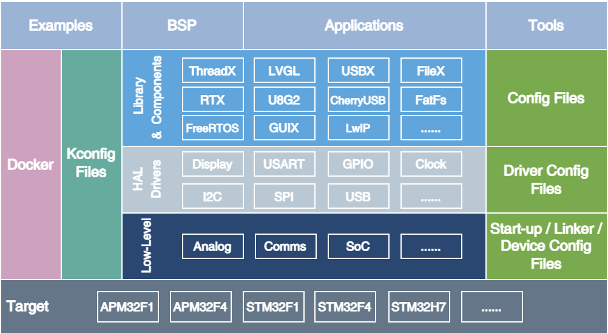
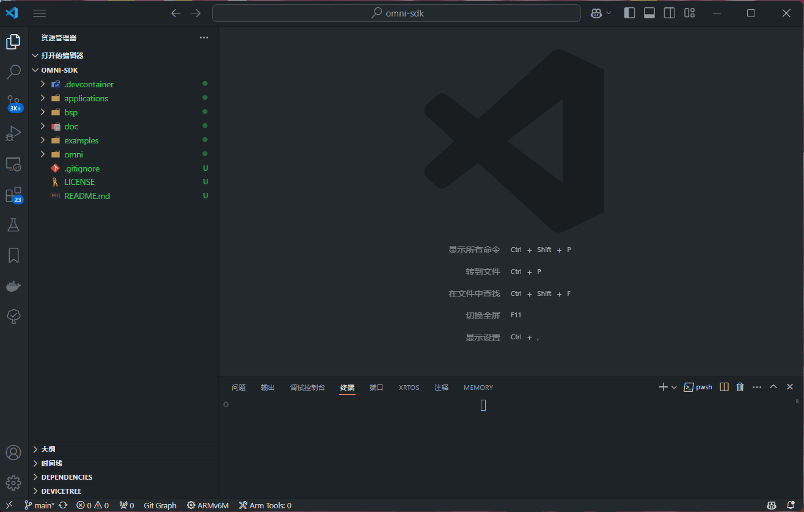
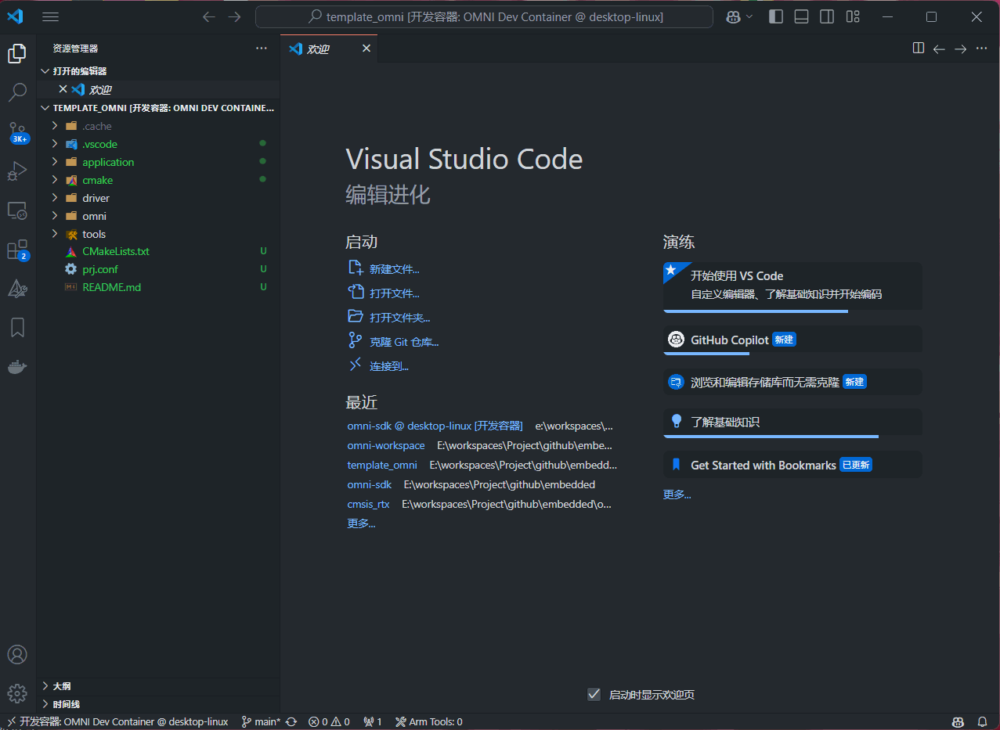

# omni-sdk

[](https://github.com/LuckkMaker/omni-sdk/releases/latest)
[](https://github.com/LuckkMaker/omni-sdk/blob/main/LICENSE)

[omni-sdk](https://github.com/LuckkMaker/omni-sdk) 项目是一个利用 CMake 和 Kconfig 进行构建的嵌入式开发框架，同时提供 HAL 层驱动和各种组件驱动。可以根据不同板卡、不同模块的需求，自由选择需要的组件，构建自己的固件。并且提供 dev container 的支持，可以在 docker 容器中快速开发、编译、调试固件，免去搭建开发环境的烦恼。



## Directory Structure

| Directory                                 | Content                                                      |
| :---------------------------------------- | :----------------------------------------------------------- |
| [applications](./applications)            | Application code                                             |
| [bsp](./bsp)                              | Board support packages                                       |
| [docs](./docs)                            | User guide                                                   |
| [examples](./examples)                    | Example code                                                 |
| [omni/cmsis](./omni/cmsis)                | CMSIS headers                                                |
| [omni/components](./omni/components)      | Components                                                   |
| [omni/drivers](./omni/drivers)            | Drivers                                                      |
| [omni/libraries](./omni/libraries)        | Third-party libraries                                        |
| [omni/targets](./omni/targets)            | Target device HAL drivers, startup files, and linker scripts |
| [omni/tests](./omni/tests)                | Test programs                                                |
| [omni/tools](./omni/tools)                | Utility tools                                                |

## Supported Platforms
现在支持的 MCU 如下，后续会继续增加支持的 MCU。

| Platform      | Device                                                |
| :------------ | :---------------------------------------------------- |
| APM32F4       | APM32F407RG                                           |
| STM32F1       | STM32F103xB, STM32F103xE                              |
| STM32F4       | STM32F405xG, STM32F407xG, STM32F411xE                 |
| STM32H7       | STM32H743xI, STM32H750xB                              |

## Getting Started

### 方式一：使用 Docker 容器搭建开发环境

Step 1 : 克隆仓库并初始化子模块。

```bash
git clone

cd omni-sdk

git submodule update --init --recursive
```

Step 2 ：用 vscode 打开 omni-sdk 项目。

Step 3 : 安装 [Dev Container](https://marketplace.visualstudio.com/items?itemName=ms-vscode-remote.remote-containers) 插件。

Step 4 : 启动 docker 容器引擎并连接到 dev container。`devcontainer.json` 和 `Dockerfile` 文件已经配置好所有开发环境。



Step 5 : 在 dev container 中构建和编译固件。



Step 6 : 安装 `JLink` 、`DapLink` 或者 `ST-Link` 的 `ubuntu` 支持，然后用 `cortex-debug` 插件调试固件。

### 方式二：本地搭建开发环境
Step 1 : 克隆仓库并初始化子模块。

```bash
git clone

cd omni-sdk

git submodule update --init --recursive
```

Step 2 : 安装和配置以下工具和环境
- [CMake](https://cmake.org/download/)
- [MinGW](https://sourceforge.net/projects/mingw-w64/)
- [GNU Arm Embedded Toolchain](https://developer.arm.com/tools-and-software/open-source-software/developer-tools/gnu-toolchain/gnu-rm)
- [OpenOCD](http://openocd.org/getting-openocd/)
- [Python](https://www.python.org/downloads/)
- kconfiglib

Step 3 : 设置`OMNI_BASE`环境变量，指向 `omni` 项目的根目录。

**linux**使用以下命令设置环境变量，或运行 `omni` 项目根目录下的 `omni-env.sh` 脚本。

```bash
export OMNI_BASE=/path/to/omni-sdk
```

**windows**运行 `omni` 项目根目录下的 `omni-env.cmd` 脚本。

## Other rlated Github repositories

- [omni-cmsis-freertos](https://github.com/LuckkMaker/omni-cmsis-freertos) - CMSIS FreeRTOS for omni
- [omni-cmsis-rtx](https://github.com/LuckkMaker/omni-cmsis-rtx) - CMSIS RTX for omni
- [omni-threadx](https://github.com/LuckkMaker/omni-threadx) - ThreadX for omni
- [omni-letter-shell](https://github.com/LuckkMaker/omni-letter-shell) - Letter shell for omni

## License

**omni-sdk** 是一个开源项目，遵循 [](https://github.com/LuckkMaker/omni-sdk/blob/main/LICENSE) 协议。欢迎大家参与贡献。

该项目包含其他项目的代码，原始许可证文本包含在这些源文件中。
